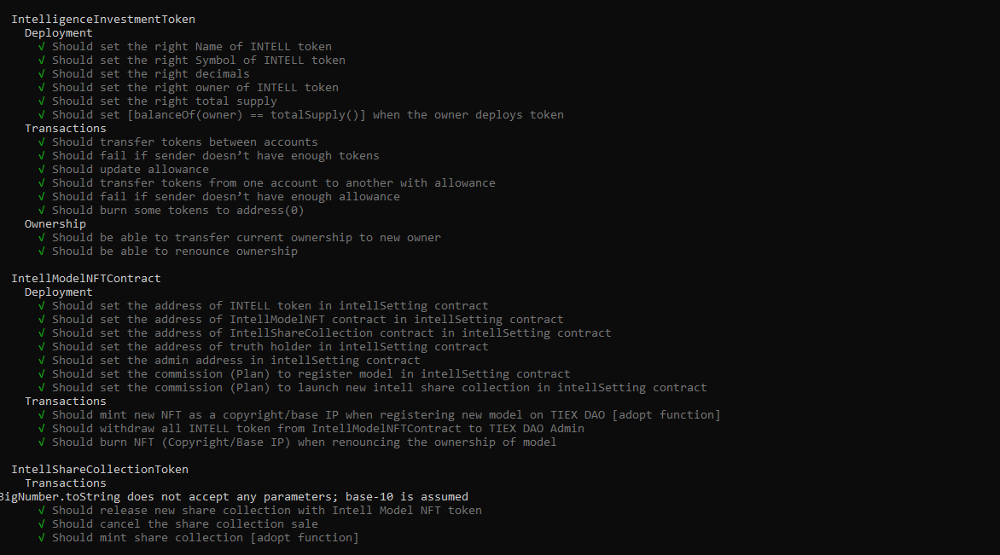
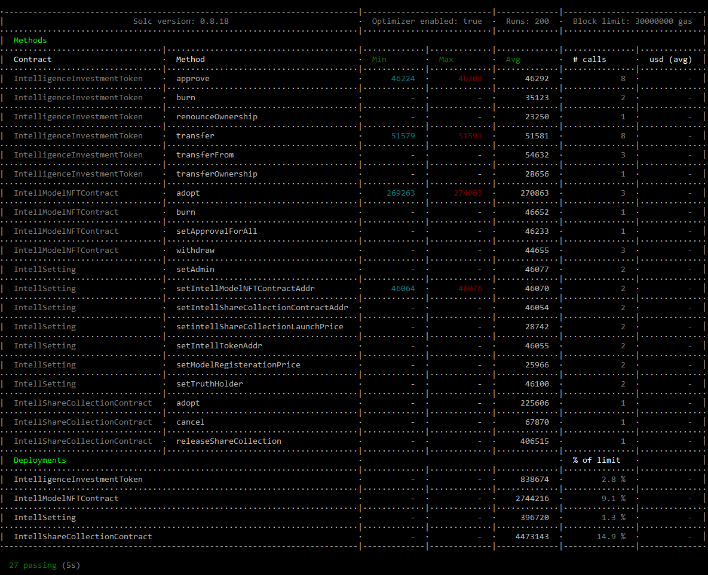
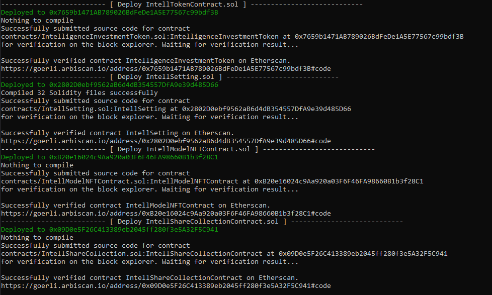

# The Intelligence Exchange DAO

- [Getting Started](#getting-started)
  - [Requirements](#requirements)
  - [Quickstart](#quickstart)
- [Usage](#usage)
- [Deployment to a testnet or mainnet](#deployment-to-a-testnet-or-mainnet)


# Getting Started

## Requirements

- [Nodejs (v19.6.1)](https://nodejs.org/dist/v19.6.1/node-v19.6.1-x64.msi)
  - You'll know you've installed nodejs right if you can run:
    - `node --version` and get an ouput like `v19.6.1`
## Quickstart

```
git clone https://gitlab.com/tiex/platform-4/smart-contracts.git
cd smart-contracts
cd intell-contracts
npm install
```


# Compile & Test

### Clean:
To clear the cache and delete the artifacts.
```sh
npm run clean
```


### Compile:

Compile the smart contracts with Hardhat:

```sh
npm run compile
```

### Test

Run the tests:

```sh
npm run test
```





# Deployment to a testnet or mainnet

<!-- ## Setup environment variabltes
  You need to set your `ETHERSCAN_API_KEY`, `TESTNET_PRIVATE_KEY` and `MAINNET_PRIVATE_KEY` as environment variables. You can add them to a `.env` file, similar to what you see in `.env.example`.

- `TESTNET_PRIVATE_KEY`: The private key of your account to deploy them on testnet   (like from [metamask](https://metamask.io/)). 

    **NOTE:** FOR DEVELOPMENT, PLEASE USE A KEY THAT DOESN'T HAVE ANY REAL FUNDS ASSOCIATED WITH IT.
  - You can [learn how to export it here](https://metamask.zendesk.com/hc/en-us/articles/360015289632-How-to-Export-an-Account-Private-Key).
- `MAINNET_PRIVATE_KEY`: The private key of your account to depoy them on mainnet

- `ETHERSCAN_API_KEY`: If you deploy to a testnet or mainnet, you can verify it if you get an [API Key](https://snowtrace.io/myapikey) from snowtrace -->

<!-- 1. Get testnet AVAX

    Head over to [faucet.avax.network](https://core.app/tools/testnet-faucet/?subnet=c&token=c) and get some tesnet AVAX. You should see the AVAX show up in your metamask. -->

1. Deploy on [Testnet(Fuji)](https://testnet.snowtrace.io/):

    ```
    npm run deploy:testnet
    ```

2. Deploy on [Mainnet(C-Chain)](https://snowtrace.io/):

    ```
    npm run deploy:mainnet
    ```

